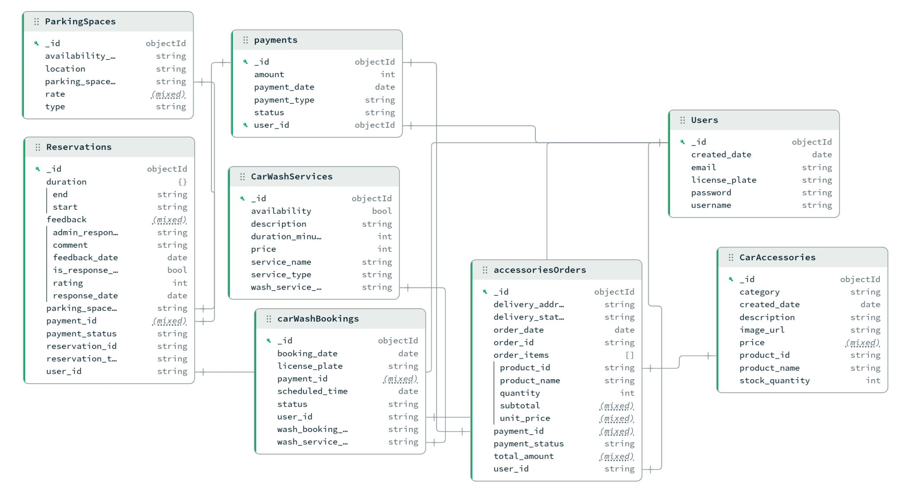

# 🚗 Smart Garage System (MongoDB)

## 📌 Overview
Smart Garage System is a smart parking management database designed to manage parking spaces, reservations, payments, car wash services, and accessories orders.

The system is built using MongoDB and deployed on MongoDB Atlas.

---

## 📊 Data Model

The following diagram illustrates the MongoDB collections and relationships 
used in the Smart Garage System.

---

## 🗄 Collections

- Users
- ParkingSpaces
- Reservations
- Payments
- CarWashServices
- carwashBookings
- CarAccessories
- accessoriesOrders
